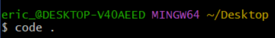
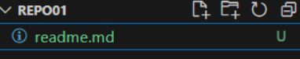
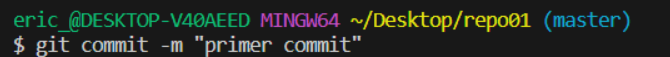
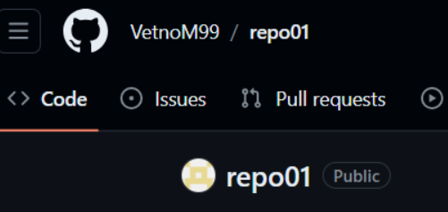
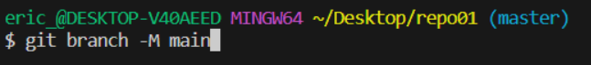
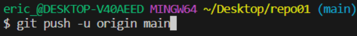

## ___Ejercicio 1 - Como crear un repositorio___
1. _Primero se habre el git.bash para realizar el proceso_
 
_Despues se moviliza a la carpeta del escritorio para mas comodidad_  
  
 _una vez en el escritorio se puede utilizar el comando __get init__ y el nombre de la carpeta_  
       

#### ___para realizarlo en un entorno visual mas comodo hare uso del visual studio code, para vincular la consola del git.bash haremos lo siguiente___

    1.1 _indicamos el comando __“code .“__ para que se nos abra el programa visual studio code_  
  

  

_ahora el visual studio code está vinculado a nivel de consola pero a nivel de archivos no, para que se vincule arrastramos la carpeta creada (repo01) hacia el programa_  
  

2. ___Creacion del archivo .md___  
    
    
    _al lado del nombre de la carpeta hay distintos botones_  

       
   _utilizaremos la primera opción_  

      

    _se crea el readme.md_  

      
   
## Pasos para subir un archivo  
|Pasos |Comando | explicacion |
|:---: |:- |----:| 
|1.|| Se verifica si el archivo esta en Undifined (no identificado,modificado o borraro)|
|2.|| para poder realizar una subida de archivos a la nube, se debe añadir dichos archivos al staged area (es decir area pre-preparada para ser subidas a la nube)|
|3.| | El commit se encarga de fijar los archivos del staged area para que sean subidos a la nube es recomendable añadirle un comentario al paquete con los distintos archivos para que no se pierda la linea de modificaciones que se puede realizar|
|4.||la primera vez que se realiza el "git push" no tenemos un puntero a donde dirigir nuestros paquetes con distintos archivos a la nube para ver si tenemos configurado algun punto se indica git remote -v|
|4.1||Primero se crea el repositorio en github|
|4.2||mediante el siguinte comando remote origin establecemos que nuestro repositorio en la nube|
|4.3||cuando se trabaja con github es recomendable cambiar el branch (rama) de master a main para mas comodidad|
|4.4||Finalmente se sube a la nube con el comando "push"